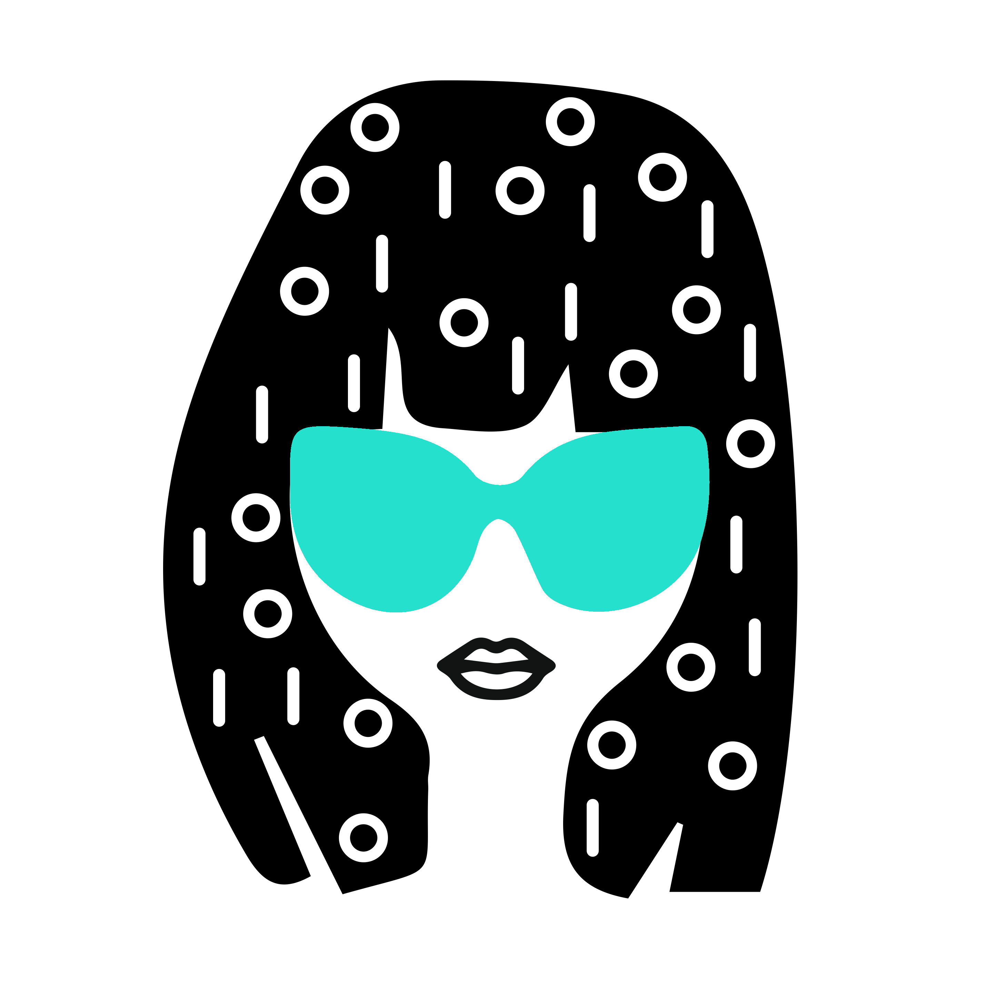

# Coder Girl

#### An online community and classroom empowering girls to code. See it live at [codergirl.io](http://codergirl.io).

## Table of Contents

1. [How it Works](#how-it-works)
2. [Motivation](#motivation)
3. [Team](#team)
4. [Contributing](#contributing)
5. [Stack](#stack)

## <a name="how-it-works" />How it Works

Coder Girls learn programming fundamentals through challenges of increasing difficulty. As they progress through challenges, users are awarded points, and top scorers are featured on an application-wide leaderboard. To create a fun and social experience, the leaderboard shows off users' Instagram feeds. As they code, users can turn to each other for support and joint problem solving through a live chatroom.

## <a name="motivation" />Motivation 

Girls make up only 19% of high school AP Computer Science test-takers, and only 12% of Computer Science degrees were earned by women at major research universities in recent years. This needs to change. We foster girls' interest in and confidence with coding at a young age. By doing so, we hope the representation of women holding computer-related occupations will increase.

## <a name="team" />Team

  - __Product Owner__: Lauren Spiegel
  - __Scrum Master__: Nimi Dharithreesan
  - __Development Team__: Mark Bennett, David Trinh, Lauren Spiegel, Nimi Dharithreesan

## <a name="contributing" />Contributing

See [CONTRIBUTING.md](documentation/CONTRIBUTING.md) for contribution guidelines. We encourage you to contribute new, fun challenges to 
help our online classroom grow. Challenges should be submitted in the following format: 

```
{
  testCode: 1,
  title: "Name of challenge",
  instructions: "Instructions to describe the challenge to complete. Use <br> tags for line breaks when needed.",
  content: "Any code you would like pre-populated in the editor. Use <br> tags for line breaks when needed.",
  pointValue: 250,
  hint1: "Provide a hint to help someone who is stuck.",
  hint2: "Provide another hint to help someone who is still stuck, even after hint1."
}
```

## <a name="stack" />Stack 

  - __Front__: React, Flux, Sass, Paper.js, Foundation, HTML5 Canvas  
  - __Back__: Node.js, Express, PostgreSQL, Instagram API, Socket.io
  - __DevOps__: Gulp, Travis.CI, Jasmine 
